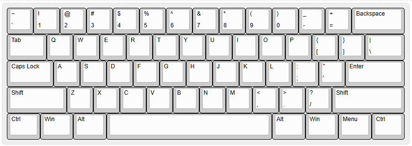
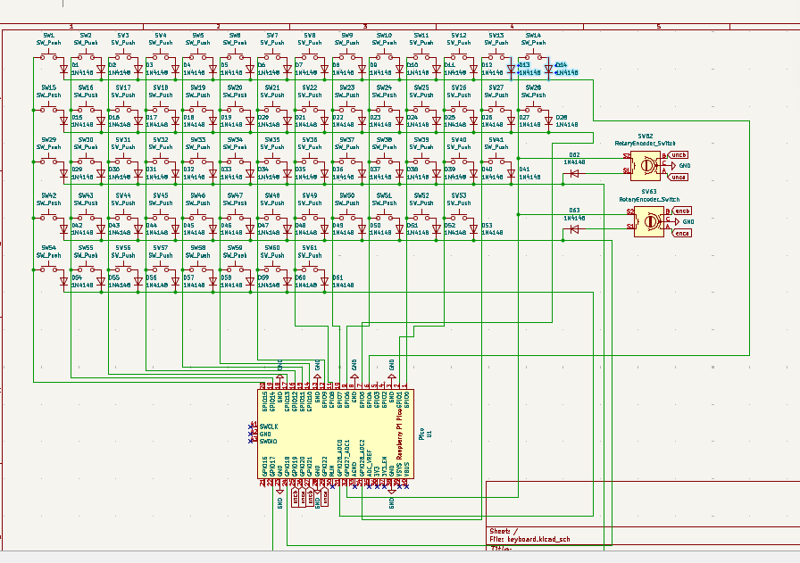
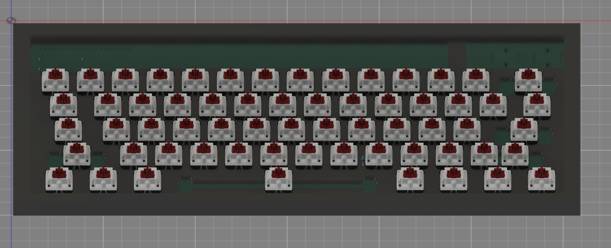
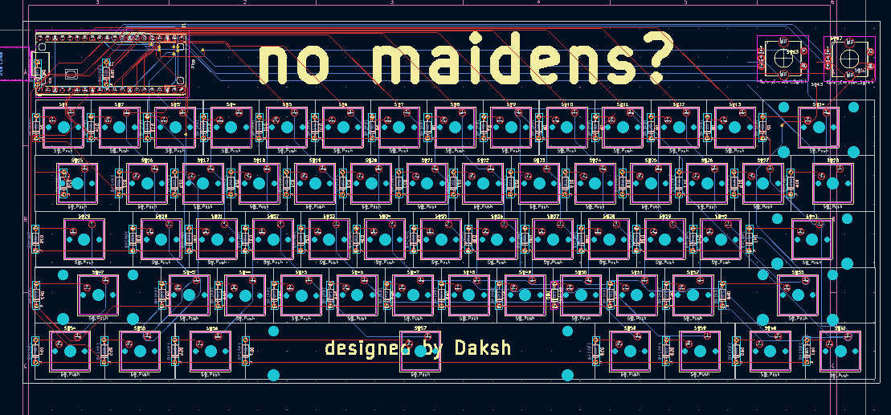

# Day 1 - June 13th(PT1)

I decided on a 60% layout, as I wanted this to travel w/ me. I used the default 60% from keyboardlayout  
 
I also made the schematic for this 
 
I wanted this keyboard to have two encoders; one for volume dialing and one for general page navigation, so I put them both there 
I did use a diode matrix, with through-hole diodes as I wanted to hand-solder this. 
Still not sure on which switches to use, but i'm certain I want something creamy/thocky. Would love to use milky whites or oil kings
**Total Time spent: 4hr**

# Day 2 - June 13th(PT2)

Today, I also routed the PCB for this - 
  
Again, I wanted to keep it small as this is a travel keyboard so the dimensions are 292x124mm 
This is a rather 'no frills' keyboard - i just want nice switches and a couple encoders and NOTHING else
**Time Spent: 6hr**

# Day 3 - June 14th

Today, I made the case 

The case is(yet again) rather simple, with a couple of slots for m5 size screws to hold the case in place. 
Other than that, nothing remarkable except for the fact I intend to use ABS for its durability(remember, this is a travel keyboard) 
Additionally, I finally settled on a [switch](https://neomacro.in/products/hmx-macchiato-linear-switch), which is the HMX macchiato and some [keycaps](https://stackskb.com/store/stackspbt-lavender-mda-profile-keycaps-131-key/)
I intend to work on the firmware and _hopefully_ ship it by EOTD 
**Time Spent: 3hr30** 

# Day 3(pt2)

Firmware was a pretty basic KMK script - everything w/ encoder and keys
