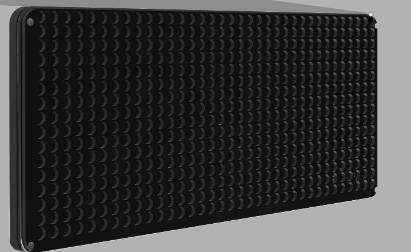
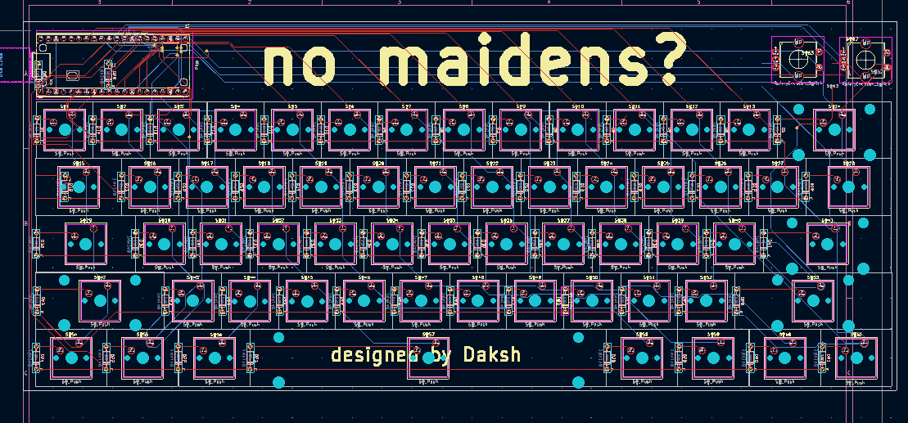
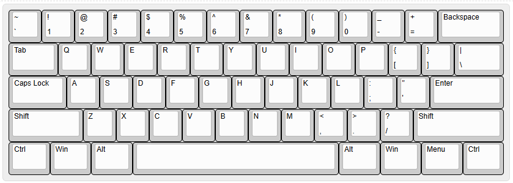
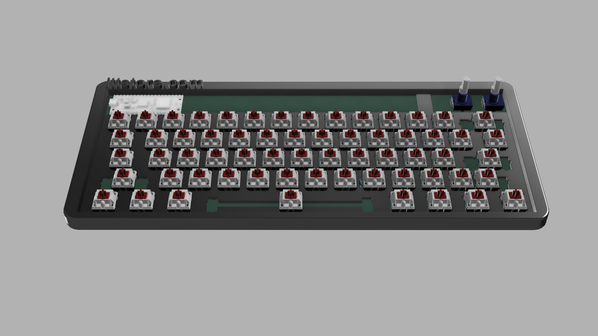
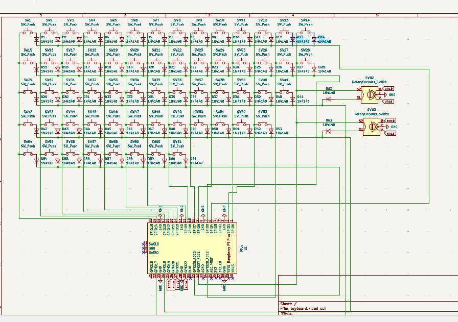
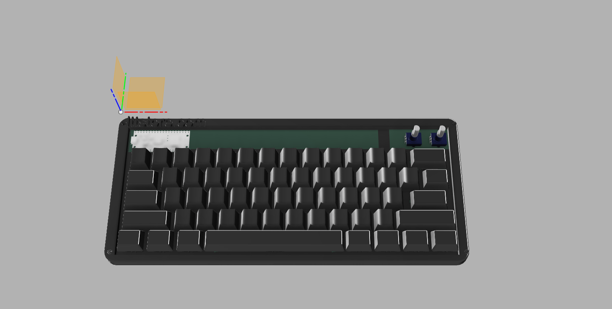
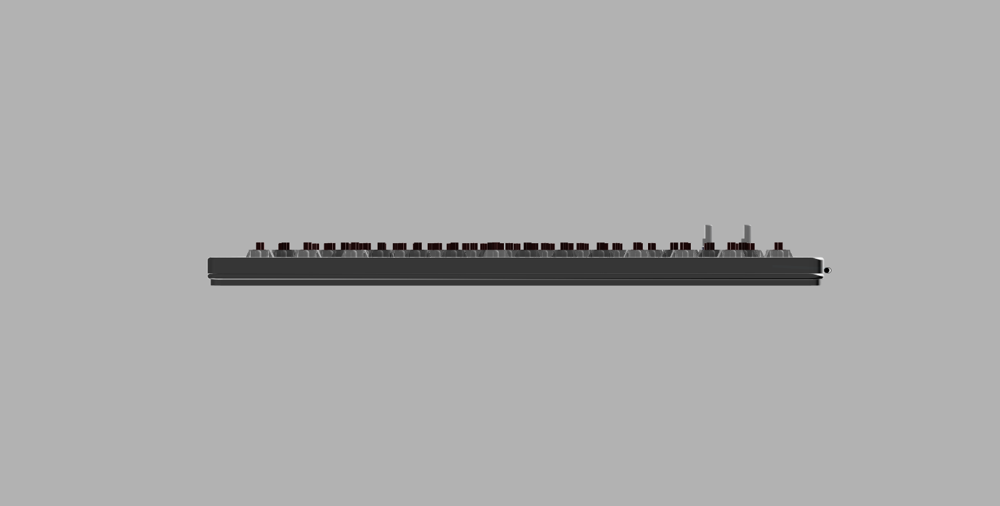
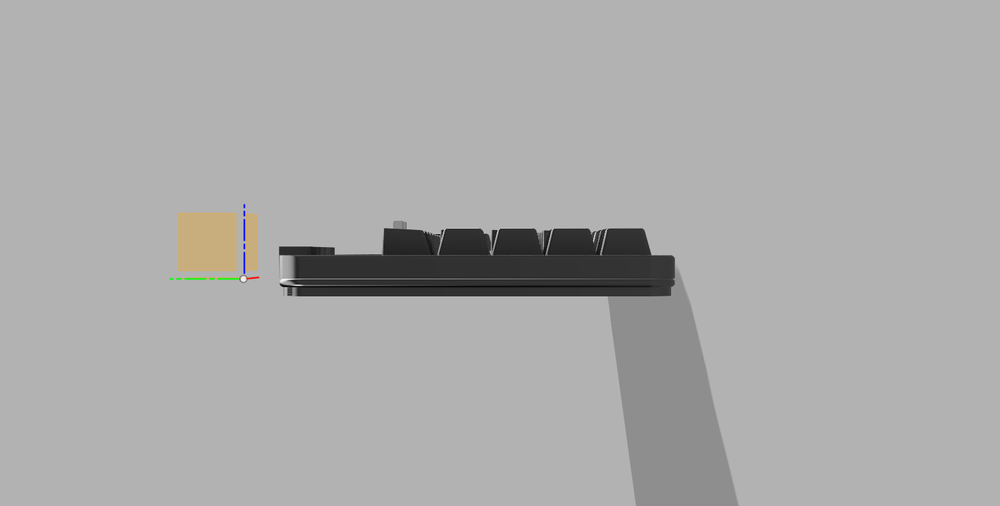
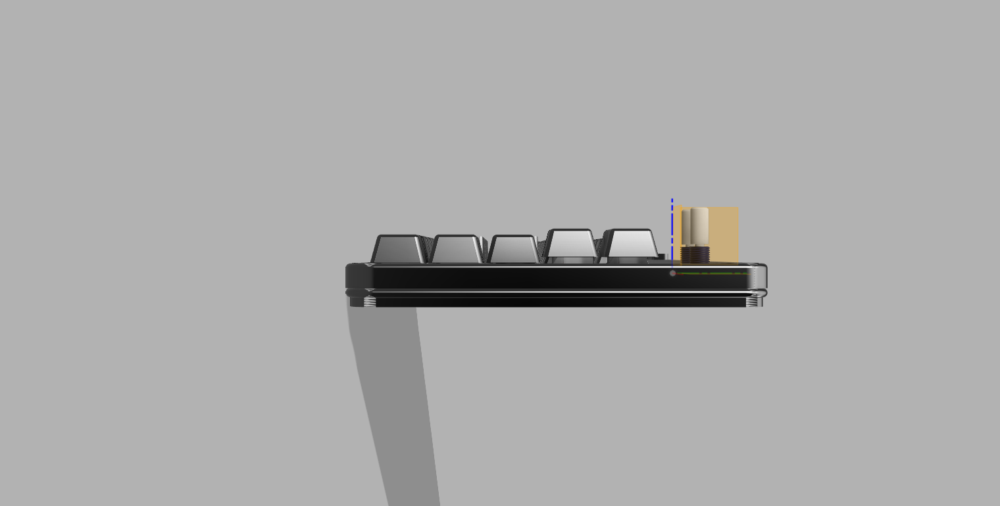
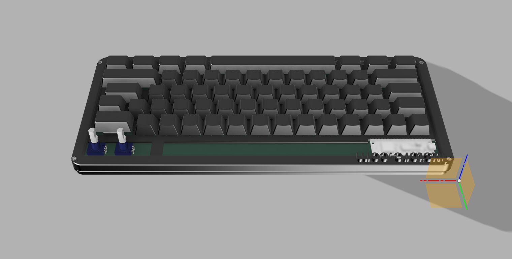

# keyboard

a travel sized 60% keyboard with two rotary encoders for extra functionality! 

## Design 

This keyboard is pretty **bog-standard**, and can be split into two basic components; the PCB and case 
**PCB**: 
Fully through hole, with a raspberry pi pico, in4018 diodes and HMX macchiato switches(cheap + sound awesome!) 
Went fully THT to keep costs as low as I can, and get some real soldering in! 
**Case**: 
Just a case covering the entire keyboard t_t
Again, owing to the purpose of the keyboard, I want to keep it small and simple, but for the shiggles I addded this cool pattern to the bottom of my case 
 

**Firmware**: 
Again, pretty standard KMK firmware running on the pico 
 

## Images

 
 
 
 

### Images of the CAD

## BOM

| ITEM                        | QTY | TOTAL  | SRC                                                                                                                                                                                                                                                                                                                                                                                                                                                                                                                                                                                                                                                                                                                                                                                                                                                                                                                                                                                                                                                                                                                                                                                            | NOTE                                 |
| --------------------------- | --- | ------ | ---------------------------------------------------------------------------------------------------------------------------------------------------------------------------------------------------------------------------------------------------------------------------------------------------------------------------------------------------------------------------------------------------------------------------------------------------------------------------------------------------------------------------------------------------------------------------------------------------------------------------------------------------------------------------------------------------------------------------------------------------------------------------------------------------------------------------------------------------------------------------------------------------------------------------------------------------------------------------------------------------------------------------------------------------------------------------------------------------------------------------------------------------------------------------------------------- | ------------------------------------ |
| HMX Macchiato Linear Switch | 7   | 24.35  | [https://neomacro.in/products/keykobo-rainbow?variant=48680982413590](https://neomacro.in/products/keykobo-rainbow?variant=48680982413590)                                                                                                                                                                                                                                                                                                                                                                                                                                                                                                                                                                                                                                                                                                                                                                                                                                                                                                                                                                                                                                                     | Sold in packs of 10 and I require 62 |
| KeyKobo Rainbow Keycap      | 1   | 43.48  | [https://neomacro.in/products/keykobo-rainbow?variant=48680982413590](https://neomacro.in/products/keykobo-rainbow?variant=48680982413590)                                                                                                                                                                                                                                                                                                                                                                                                                                                                                                                                                                                                                                                                                                                                                                                                                                                                                                                                                                                                                                                     |                                      |
| Raspberry Pi Pico 2         | 1   | 4.79   | [https://www.amazon.in/Raspberry-Pico-All-Microcontroller-Board/dp/B0B69KZBD8/ref=sr_1_1?crid=2SX0N4M63ZWH0&dib=eyJ2IjoiMSJ9.AG5JhGRrljClCgda-pmbDiD1qgK6UMgZNUfO6lCjvNRDwukhXHZauoI63nwYufeCMjrTgOu-PR4EB1B7bBTxMx_hHgDObzbV_989GRUKeAKs9bf6mNNWnI8RB88uI3AtziqfbLDEnSlC9C45SWxsgeOhS_r8351-swVnHh5PpfJFPoSv4LKkKSLkdM34SVLB4KbwTGd2ggQV1Gwpf81-vTKtUTg3C4Jg-lUPle1kBh8.S8F72l44oyaOFh3p5GCZGWSFGbHGolIi6mE-abOFBGI&dib_tag=se&keywords=raspi+pico&qid=1755337610&sprefix=raspi+pic,aps,281&sr=8-1&th=1](https://www.amazon.in/Raspberry-Pico-All-Microcontroller-Board/dp/B0B69KZBD8/ref=sr_1_1?crid=2SX0N4M63ZWH0&dib=eyJ2IjoiMSJ9.AG5JhGRrljClCgda-pmbDiD1qgK6UMgZNUfO6lCjvNRDwukhXHZauoI63nwYufeCMjrTgOu-PR4EB1B7bBTxMx_hHgDObzbV_989GRUKeAKs9bf6mNNWnI8RB88uI3AtziqfbLDEnSlC9C45SWxsgeOhS_r8351-swVnHh5PpfJFPoSv4LKkKSLkdM34SVLB4KbwTGd2ggQV1Gwpf81-vTKtUTg3C4Jg-lUPle1kBh8.S8F72l44oyaOFh3p5GCZGWSFGbHGolIi6mE-abOFBGI&dib_tag=se&keywords=raspi+pico&qid=1755337610&sprefix=raspi+pic,aps,281&sr=8-1&th=1)                                                                                                                                                                             |                                      |
| IN4148 diode                | 100 | 1.74   | [https://www.amazon.in/100PCS-1N4148-IN4148-switching-Switching/dp/B08DYFFYPQ](https://www.amazon.in/100PCS-1N4148-IN4148-switching-Switching/dp/B08DYFFYPQ)                                                                                                                                                                                                                                                                                                                                                                                                                                                                                                                                                                                                                                                                                                                                                                                                                                                                                                                                                                                                                                   |                                      |
| EC11 Encoder                | 2   | 2.06   | [https://www.amazon.in/dp/B0888RVZSN?social_share=cm_sw_r_cp_ud_dp_ECM6496E6Q914JPQP2XQ&\_encoding=UTF8&psc=1](https://www.amazon.in/dp/B0888RVZSN?social_share=cm_sw_r_cp_ud_dp_ECM6496E6Q914JPQP2XQ&_encoding=UTF8&psc=1)                                                                                                                                                                                                                                                                                                                                                                                                                                                                                                                                                                                                                                                                                                                                                                                                                                                                                                                                                                    |                                      |
| PCB Cost                    | 1   | 39.55  | JLCPCB                                                                                                                                                                                                                                                                                                                                                                                                                                                                                                                                                                                                                                                                                                                                                                                                                                                                                                                                                                                                                                                                                                                                                                                         | Without coupon, including shipping   |
| M5 CSK Screws               | 15  | 1.71   | [https://www.amazon.in/RT-SENSE-Countersunk-Machine-tensile/dp/B0CZDXM5NJ/ref=sr_1_4?crid=TGL04IS2H7U4&dib=eyJ2IjoiMSJ9.-ETdl_9o0rQhq2v8QyvieSeZBwawFgI0otkrKzwH_3Kr6CDDPBLv5RKM2_BuHqXBQlgEFxbOraN_T8u7Prs0k_uBT1Lap6PuIfB5L00UkwsWeFqAUkovVYp5cKpsNdlAAAIpJ3XXII_SnrmWUHdrnR_Qm5SZUBb-8-pTL84gnmdmh3BZrIbskamtTstUBqwtsfaHfz_QWUSj6JO8KaddyIW3fzTGaVdQQMOTJFMSkXs3UvAkW26RJIoPtypqXWIEqhShBDmE66IfQqOCSBbTQMD0UUzCtQ2SWeOWagk2JB0.xHmdo73Vnp2HuIfA9RUYqdI207I3gBPz6IcrGBW5zD0&dib_tag=se&keywords=m5+countersunk&qid=1755337697&s=industrial&sprefix=m5+countersu,industrial,263&sr=1-4&th=1](https://www.amazon.in/RT-SENSE-Countersunk-Machine-tensile/dp/B0CZDXM5NJ/ref=sr_1_4?crid=TGL04IS2H7U4&dib=eyJ2IjoiMSJ9.-ETdl_9o0rQhq2v8QyvieSeZBwawFgI0otkrKzwH_3Kr6CDDPBLv5RKM2_BuHqXBQlgEFxbOraN_T8u7Prs0k_uBT1Lap6PuIfB5L00UkwsWeFqAUkovVYp5cKpsNdlAAAIpJ3XXII_SnrmWUHdrnR_Qm5SZUBb-8-pTL84gnmdmh3BZrIbskamtTstUBqwtsfaHfz_QWUSj6JO8KaddyIW3fzTGaVdQQMOTJFMSkXs3UvAkW26RJIoPtypqXWIEqhShBDmE66IfQqOCSBbTQMD0UUzCtQ2SWeOWagk2JB0.xHmdo73Vnp2HuIfA9RUYqdI207I3gBPz6IcrGBW5zD0&dib_tag=se&keywords=m5+countersunk&qid=1755337697&s=industrial&sprefix=m5+countersu,industrial,263&sr=1-4&th=1) |                                      |
|                             |     |        |                                                                                                                                                                                                                                                                                                                                                                                                                                                                                                                                                                                                                                                                                                                                                                                                                                                                                                                                                                                                                                                                                                                                                                                                |                                      |
|                             |     | 117.68 |                                                                                                                                                                                                                                                                                                                                                                                                                                                                                                                                                                                                                                                                                                                                                                                                                                                                                                                                                                                                                                                                                                                                                                                                |                                      |
