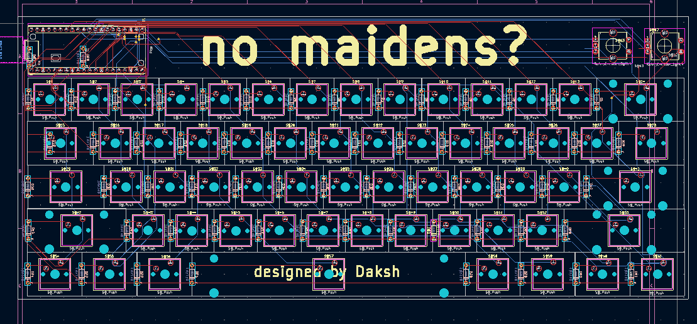
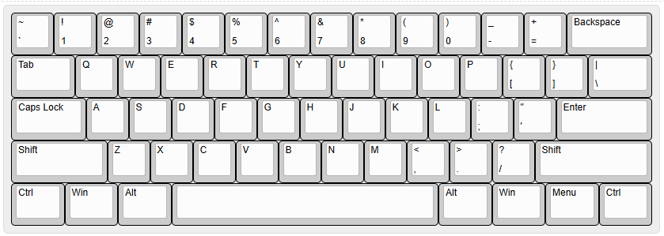
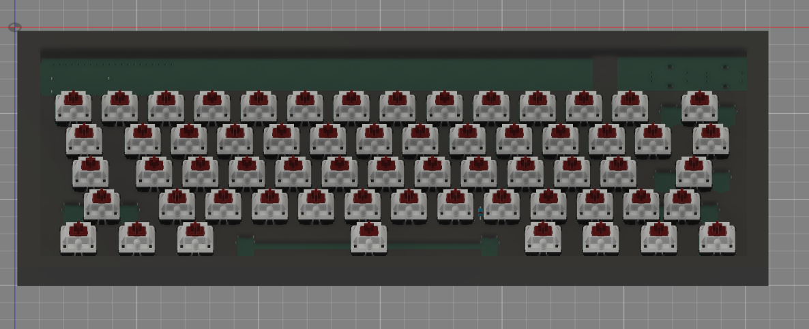

# keyboard

a travel sized 60% keyboard with two rotary encoders for extra functionality! 

## Design 

This keyboard is pretty **bog-standard**, and can be split into two basic components; the PCB and case 
**PCB**: 
Fully through hole, with a raspberry pi pico, in4018 diodes and HMX macchiato switches 
**Case**: 
Just a case covering the entire keyboard t_t
Again, owing to the purpose of the keyboard, I want to
 

## Images

 
 
 
 

## BOM

| HMX Macchiato Linear Switch | 7   | 24.35 | [https://neomacro.in/products/keykobo-rainbow?variant=48680982413590](https://neomacro.in/products/keykobo-rainbow?variant=48680982413590)                                                                                                                                                                                                                                                                                                                                                                                                                                                                                                                                                                                                                                                                                                                                                                                                                                                                                                                                      | Sold in packs of 10 and I require 62 |
| --------------------------- | --- | ----- | ------------------------------------------------------------------------------------------------------------------------------------------------------------------------------------------------------------------------------------------------------------------------------------------------------------------------------------------------------------------------------------------------------------------------------------------------------------------------------------------------------------------------------------------------------------------------------------------------------------------------------------------------------------------------------------------------------------------------------------------------------------------------------------------------------------------------------------------------------------------------------------------------------------------------------------------------------------------------------------------------------------------------------------------------------------------------------- | ------------------------------------ |
| KeyKobo Rainbow Keycap      | 1   | 43.48 | [https://neomacro.in/products/keykobo-rainbow?variant=48680982413590](https://neomacro.in/products/keykobo-rainbow?variant=48680982413590)                                                                                                                                                                                                                                                                                                                                                                                                                                                                                                                                                                                                                                                                                                                                                                                                                                                                                                                                      |                                      |
| Raspberry Pi Pico 2         | 1   | 9.76  | [https://www.amazon.in/Raspberry-Microcontroller-Dual-Core-Support-Performance/dp/B0DT983C25/ref=sr_1_1?crid=2SHBM0CHJZF3G&dib=eyJ2IjoiMSJ9.7UHjkyeb-z1ocPO3Kq9l_bhYbUN6nS1ngNOEt0LRWvaYepxbrTFM_SuqdoMGF1qMUTUs-\_4d-rc1NyZwjv0jH4NUl3Nk1fOHdD1Ers58grxYYsZBnAL1WYX3R91Yns-iqBLub8rurQ758dCQ18Gys9k9VxiMYtUmXm5idyOONeEwZ_jtfLKMq4UkIYgumZpqejRmkkb5Qrkg0IQoVOyQF_9AlXfPy1_SnQrQCk1ZQhE.Hpl6Rg4mGyxc_5wFCAYF8Xur3OHnWNw-HFPuJ1DoEOc&dib_tag=se&keywords=raspberry+pi+pico+2&qid=1750005841&sprefix=raspberry+pi+pico+2+,aps,234&sr=8-1](https://www.amazon.in/Raspberry-Microcontroller-Dual-Core-Support-Performance/dp/B0DT983C25/ref=sr_1_1?crid=2SHBM0CHJZF3G&dib=eyJ2IjoiMSJ9.7UHjkyeb-z1ocPO3Kq9l_bhYbUN6nS1ngNOEt0LRWvaYepxbrTFM_SuqdoMGF1qMUTUs-_4d-rc1NyZwjv0jH4NUl3Nk1fOHdD1Ers58grxYYsZBnAL1WYX3R91Yns-iqBLub8rurQ758dCQ18Gys9k9VxiMYtUmXm5idyOONeEwZ_jtfLKMq4UkIYgumZpqejRmkkb5Qrkg0IQoVOyQF_9AlXfPy1_SnQrQCk1ZQhE.Hpl6Rg4mGyxc_5wFCAYF8Xur3OHnWNw-HFPuJ1DoEOc&dib_tag=se&keywords=raspberry+pi+pico+2&qid=1750005841&sprefix=raspberry+pi+pico+2+,aps,234&sr=8-1) |                                      |
| IN4148 diode                | 100 | 1.74  | [https://www.amazon.in/100PCS-1N4148-IN4148-switching-Switching/dp/B08DYFFYPQ](https://www.amazon.in/100PCS-1N4148-IN4148-switching-Switching/dp/B08DYFFYPQ)                                                                                                                                                                                                                                                                                                                                                                                                                                                                                                                                                                                                                                                                                                                                                                                                                                                                                                                    |                                      |
| EC11 Encoder                | 2   | 2.06  | [https://www.amazon.in/dp/B0888RVZSN?social_share=cm_sw_r_cp_ud_dp_ECM6496E6Q914JPQP2XQ&\_encoding=UTF8&psc=1](https://www.amazon.in/dp/B0888RVZSN?social_share=cm_sw_r_cp_ud_dp_ECM6496E6Q914JPQP2XQ&_encoding=UTF8&psc=1)                                                                                                                                                                                                                                                                                                                                                                                                                                                                                                                                                                                                                                                                                                                                                                                                                                                     |                                      |
| PCB Cost                    | 1   | 39.55 | JLCPCB                                                                                                                                                                                                                                                                                                                                                                                                                                                                                                                                                                                                                                                                                                                                                                                                                                                                                                                                                                                                                                                                          | Without coupon, including shipping   |
| M5 CSK Screws               | 10  | 0.36  |                                                                                                                                                                                                                                                                                                                                                                                                                                                                                                                                                                                                                                                                                                                                                                                                                                                                                                                                                                                                                                                                                 |                                      |
|                             |     |       |                                                                                                                                                                                                                                                                                                                                                                                                                                                                                                                                                                                                                                                                                                                                                                                                                                                                                                                                                                                                                                                                                 |                                      |
|                             |     | 121.3 |
